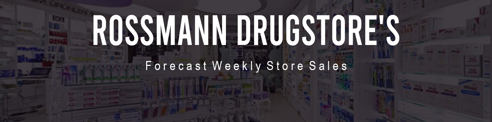
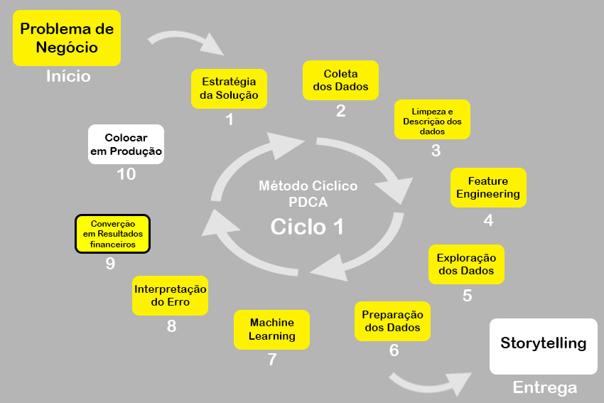

# Rossmann Drugstore's
## 1.0 Forecast Weekly Store Sales

## 2.0 Business Problem and Business Questions
A Rossmann opera mais de 3.000 drogarias em 7 países europeus. Atualmente, os gerentes de loja da Rossmann têm a tarefa de prever suas vendas diárias com até seis semanas de antecedência. As vendas da loja são influenciadas por muitos fatores, incluindo promoções, competição, feriados escolares e estaduais, sazonalidade e localidade.

Você foi contratado para responder às perguntas do time de negócios da empresa, gerar insights e criar um modelo de predições acessível e de fácil utilização, para que os gerentes possam fazer as suas consultas. A aplicação deverá estar disponível em cloud e a consulta será feita através de uma planilha do tipo Google Sheets.
1. Qual será o faturamento semanal de cada loja para as próximas **15** semanas?
2. Melhores insights sobre o impacto das features no faturamento das lojas.
3. Quais são as condições ideais que os diretores deverão ter como base quando forem abrir a próxima loja Rossmann?

### 2.1 Tools, Requirements and Restrictions
- Linguagem: Python
- Desenvolvimento e entrega do projeto: Jupyter Notebook
- Cloud: Heroku
- Plataforma de request: Google Sheets

## 3.0 Business Assumptions
## 4.0 Solution Strategy
### 4.1 Outputs
1. Através do Jupyter Notebook. Uma tabela contendo: [ período | loja | previsão de faturamento ]
2. Através do Jupyter Notebook. Gráficos e informações sobre os melhores insights.
3. Melhores parâmetros para otimização do faturamento.

### 4.2 Solution Planning
1. Trabalhar os dados, treinar o modelo e gerar a tabela com os predicts.
2. Fazer uma análise exploratória de dados.
3. Utilizar a análise exploratória de dados para identificar os melhores valores para cada feature.

### 4.3 Steps
1. Data Cescription - uma descrição estatística dos dados para entender os shapes das distribuições, quantidades de categorias, tamanho do dataset, dados faltantes e discrepancias.
2. Feature Engineering - criação de variáveis que ajudem a modelar o fenômeno, e auxilie na geração de insights e entendimento de negocio.
3. Data Filtering - filtragem de variáveis e amostras que não farão parte dos demais passos do desenvolvimento do projeto.
4. Exploratory Data Analysis - ampliar o entendimento de negócio, criar e testar hipóteses e ganho de entendimento do impacto das features e suas importâncias para a modelagem do fenômeno.
5. Data Prepataion - preparar os dados para o aprendizado dos modelos, de acordo com as particularidades de cada algorítmo.
6. Feature Selecion - selecionar as features que devem ou não seguir para a modelagem, tendo em vista o conceito de evitar complexidades desnecessárias.
7. Machine Learning Modeling - treinamento dos modelos e escolha do melhor modelo.
8. Hiperparameter Fining Tunning - ajuste dos parâmetros de aprendizagem.
9. Convert Model Performance to Business Values - conversão das métricas de erro em retornos financeiros.
10. Deploy Model to Predictions - disponibilizar a aplicação para consultas.

## 5.0 Top 3 Data Insights
## 6.0 Machine Learning Model Applied
**XGBoost Regressor**
## 7.0 Machine Learning Performance

## 8.0 Business Results
## 9.0 Conclusions
## 10.0 Leassons Learned
## 11.0 Summary:
- Id - an Id that represents a (Store, Date) duple within the test set
- Store - a unique Id for each store
- Sales - the turnover for any given day (this is what you are predicting)
- Customers - the number of customers on a given day
- Open - an indicator for whether the store was open: 0 = closed, 1 = open
- StateHoliday - indicates a state holiday. Normally all stores, with few exceptions, are closed on state holidays. Note that all schools are closed on public holidays and weekends. a = public holiday, b = Easter holiday, c = Christmas, 0 = None
- SchoolHoliday - indicates if the (Store, Date) was affected by the closure of public schools
- StoreType - differentiates between 4 different store models: a, b, c, d
- Assortment - describes an assortment level: a = basic, b = extra, c = extended
- CompetitionDistance - distance in meters to the nearest competitor store
- CompetitionOpenSince[Month/Year] - gives the approximate year and month of the time the nearest competitor was opened
- Promo - indicates whether a store is running a promo on that day
- Promo2 - Promo2 is a continuing and consecutive promotion for some stores: 0 = store is not participating, 1 = store is participating
- Promo2Since[Year/Week] - describes the year and calendar week when the store started participating in Promo2
- PromoInterval - describes the consecutive intervals Promo2 is started, naming the months the promotion is started anew. E.g. "Feb,May,Aug,Nov" means each round starts in February, May, August, November of any given year for that store

## 12.0 Next Steps: 
**Continue Exploratory Data Analysis**
## 13.0 Project Status:

